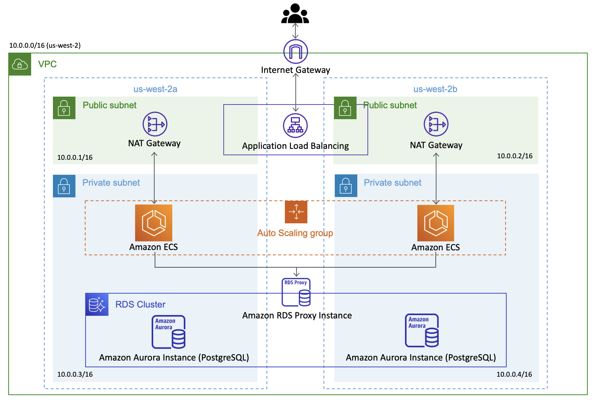

# user-api

## Architecture

Architecture diagrams are coming soon!



## Project Structure

user-api uses FastAPI framework with asynchronous REST endpoints and database queries.

### api

Endpoints are defined in `./app/api/endpoints/`. AWS Cognito JWT authenitcation handling is defined in `./app/api/auth/` and injected as dependencies for all the endpoints that require authentiation.

### crud

All functionalities that involve data model i.e. CRUD functions can be found in `./app/crud/`.

### db

The app connects to the database when it starts running and closes when it stops. The connectino management is handled in `./app/db/`.

### models

The table definitions are stored in `./app/schema`. 

### schemas

We use SQLAlchemy having a layer on top of the raw data model. The SQLAlchemy models are defined in `./app/models/`.

## Components

### AWS ECS

We use ECS (Elastic Container Service) to run the backend. The API code is dockerized and uploaded to ECR (Elastic Container Registry), which will be run by the instances in ECS.

### AWS Load Balancer

We run two ECS tasks in different availability zones. Load balancer redirects incoming traffic into one of these tasks.

### AWS Auto Scaling

Dependin on the utilization level, the number of container instances in each cluster is adjusted.

### AWS RDS

Core user database that is used by [presence-api](https://github.com/PageNow/presence-api) and [chat-api](https://github.com/PageNow/chat-api) as well.

* `user_table` stores user information.

* `friendship_table` stores friendship relationships. We use a single table to express the relationship between two users. We distinuish *none friendship*, *pending friendship*, and *accepted friendship* by the *accepted_at* attribute. 

### AWS API Gateway

* API Gateway passes request through to the load balancer. 

## Setup

### Database (Postgres) migration

Run
```shell
$ docker-compose run web alembic revision --autogenerate -m "MESSAGE" # make migrations
$ docker-compose run web alembic upgrade head # migrate
```

To reset alembic versions, connect to docker postgres, drop all the tables in the datbase.

## Running Locally

### Running by itself

To run the server locally (not with docker), run
```shell
$ export RDS_HOST=localhost
$ uvicorn app.main:app --host 0.0.0.0 --port 8000 --reload
```

### Running on Docker

Run
```shell
$ docker-compose up -d # build and deploy
```

### Connect to Dockerized postgres

Run
```shell
docker exec -it postgres_local psql -h localhost -U USERNAME --dbname=DBNAME
```

## Cloud Development

### Uploading Docker image to ECR

Execute the following commands as instructed at ECR console. Replace 257206538165 with your AWS Account ID.
```shell
$ aws ecr get-login-password --region us-west-2 | docker login --username AWS --password-stdin 257206538165.dkr.ecr.us-west-2.amazonaws.com
$ docker build -t 257206538165.dkr.ecr.us-west-2.amazonaws.com/pagenow-user-api:latest .
$ docker push 257206538165.dkr.ecr.us-west-2.amazonaws.com/pagenow-user-api:latest
```

### Update ECS task definition after updating ECS code

After building and pushgin Docker image to ECR, run
```shell
$ python update-ecs.py --cluster=user-api-production-cluster --service=user-api-production-service
```

### Terraform Setup

Set AWS credentials as environment variables
```shell
$ export AWS_ACCESS_KEY_ID="YOUR_AWS_ACCESS_KEY_ID"
$ export AWS_SECRET_ACCESS_KEY="YOUR_AWS_SECRET_ACCESS_KEY"
$ export AWS_DEFAULT_REGION="YOUR_AWS_REGION"
```

Set RDS password by running
```shell
$ export TF_VAR_rds_password=RDS_PASSWORD
```

Then, update the cloud resources by running
```shell
$ terraform plan
$ terraform apply
```

Set up API Gateway following instructions at https://docs.aws.amazon.com/apigateway/latest/developerguide/api-gateway-create-api-as-simple-proxy-for-http.html where endpoint url is 'http://${alb_dns}/{proxy}' and deploy.

### RDS Access using Bastion instance

We access RDS via a bastion EC2 instance because the ECS instances are inside private subnets.

1. Get the public IP address of bastion-instance and the private IP address of private-instance.
2. Update the SSH config file (`~/.ssh/config`) as follows.
```
Host bastion-instance
   HostName <Bastion Public IP>
   User ubuntu
Host private-instance
   HostName <Private IP>
   User ubuntu
   ProxyCommand ssh -q -W %h:%p bastion-instance
```
3. SSH into private-instance by running `ssh -i "~/.ssh/id_rsa" private-instance`.

### ECS RDS Setup

1. SSH into EC2 instance following the steps above.
2. Run `docker ps` to obtain the docker container id.
3. Run `docker exec -it DOCKER_CONTAINER_ID alembic revision --autogenerate -m "MESSAGE"`
4. Run `docker exec -it DOCKER_CONTAINER_ID alembic upgrade head`.

## References

### FastAPI with Postgres

* https://fastapi.tiangolo.com/tutorial/sql-databases/#create-the-pydantic-models
* https://ahmed-nafies.medium.com/fastapi-with-sqlalchemy-postgresql-and-alembic-and-of-course-docker-f2b7411ee396
* https://www.jeffastor.com/blog/pairing-a-postgresql-db-with-your-dockerized-fastapi-app

### FastAPI with Cognito JWT

* https://gntrm.medium.com/jwt-authentication-with-fastapi-and-aws-cognito-1333f7f2729e

### SQLAlchemy

* http://www.dein.fr/writing-a-subquery-with-sqlalchemy-core.html
* https://overiq.com/sqlalchemy-101/crud-using-sqlalchemy-core/
* https://stackoverflow.com/questions/3576382/select-as-in-sqlalchemy

### Asyncio

* https://medium.com/@s.zeort/asynchronous-aws-s3-client-in-python-4f6b33829da6
* https://medium.com/tysonworks/concurrency-with-boto3-41cfa300aab4
* https://www.trek10.com/blog/aws-lambda-python-asyncio

### RDS Proxy Terraform

* https://aws.plainenglish.io/have-your-lambda-functions-connect-to-rds-through-rds-proxy-c94072560eee
* https://www.jbssolutions.com/resources/blog/amazon-rds-proxy-terraform/

### Connecting to AWS instance in private subnet
* https://towardsdatascience.com/connecting-to-an-ec2-instance-in-a-private-subnet-on-aws-38a3b86f58fb

### Testing

* https://testdriven.io/blog/fastapi-crud/
* https://www.jeffastor.com/blog/testing-fastapi-endpoints-with-docker-and-pytest

### NAT Gateway

* https://stackoverflow.com/questions/59525573/can-a-single-nat-gateway-span-across-multiple-az
* https://stackoverflow.com/questions/42960678/what-is-the-difference-between-a-task-and-a-service-in-aws-ecs
* https://www.freecodecamp.org/news/amazon-ecs-terms-and-architecture-807d8c4960fd/#:~:text=As%20seen%20above%2C%20a%20Cluster,Cluster%20can%20run%20many%20Services.
