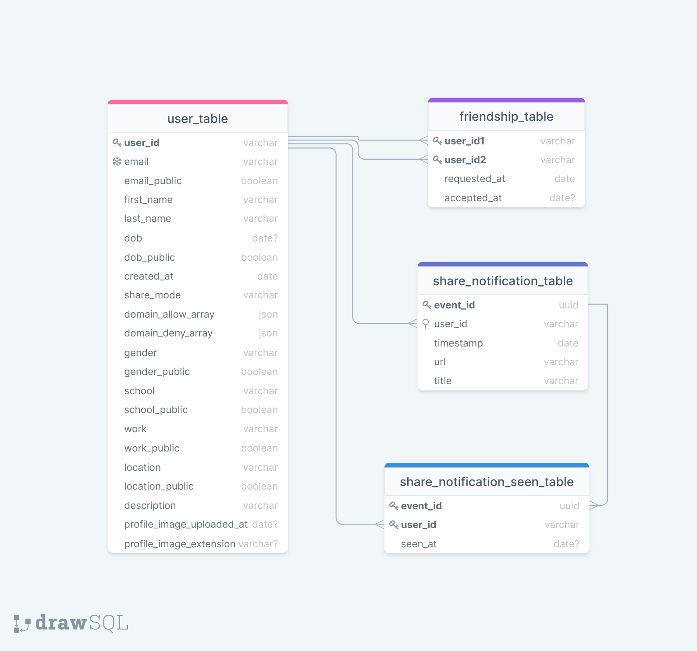

[한국어 README.md](./README_KO.md)

PageNow Home Page: https://pagenow.io <br/>
PageNow Chrome Web Store: https://chrome.google.com/webstore/detail/pagenow/lplobiaakhgkjcldopgkbcibeilddbmc

# PageNow User API

User API is the backend providing REST API endpoints related to user information, friend relatinoship, and notifications. User API is **scalable** as it supports auto-scaling and is running in multiple avalizability zones. It is also **secure** as the EC2 instances and database instances are running inside private subnets in Virtual Private Cloud, thus being inaccessible from the outside.

Fast API is used for the server. PostgreSQL is used for the database. Terraform is used for cloud deployment. Performance is optimized through asynchronous Python functions and using database indexing appropriately.

## Architecture

Below is the system architecture diagram.


## Components

Below are explanations for each component used in user-api.

### AWS ECS

We use ECS (Elastic Container Service) to run the backend. The API code is dockerized and uploaded to ECR (Elastic Container Registry), which will be run by the instances in ECS.

### AWS Application Load Balancer

We run two ECS tasks, one in each availability zone (us-west2a and us-west2b). Load balancer redirects incoming traffic into one of these tasks.

### AWS Auto Scaling

The number of container instances in each cluster is automatically adjusted based on the utilization level.

### AWS RDS

Amazon Aurora PostgreSQL instances are running in RDS cluster running in two availability zones. These instances host `core_db` which is also used by [presence-api](https://github.com/PageNow/presence-api) and [chat-api](https://github.com/PageNow/chat-api) as well.

* `user_table` stores user information, like email, name, and domain allow/deny array.

* `friendship_table` stores friendship relationships. A single table is used to express the relationship between two users. We distinuish *none friendship*, *pending friendship*, and *accepted friendship* by the *accepted_at* attribute.

* `share_notification_table` stores share_notification events. A share notification is the notification that a user shares a page actively with friends. Each event is composed of the page url and title.

* `share_notification_seen_table` stores whether a user has read share notifications sent to him/her. *event_id* is a foreign key to *share_notification_table*. *seen_at* is null if the share notification is unread. The timestamp of when the notification is read saved in *seen_at* column.

The SQL diagram is as follows.



### AWS RDS Proxy

RDS Proxy handles pooling and sharing established connections, allowing efficient scaling of database connections. It is used because [presence-api](https://github.com/PageNow/presence-api) and [chat-api](https://github.com/PageNow/chat-api) also connect to RDS core_db.

### AWS API Gateway

API Gateway passes request through to the load balancer. 

## Project Structure

User API uses FastAPI framework with asynchronous REST endpoints and database queries.

### api

Endpoints are defined in [app/api/endpoints](./app/api/endpoints/). AWS Cognito JWT authenitcation process is defined in [app/api/auth](./app/api/auth/) and injected as a dependency for all the endpoints that require authentiation.

### crud

All functionalities that involve data model i.e. CRUD functions can be found in [app/crud](`./app/crud/`).

### db

The app connects to the database when it starts running and closes when it stops. The connectino management is handled in [app/db](`./app/db/`).

### models

The table definitions are stored in [app/models](`./app/models`). When a new table is added, [alembic/env.py](./alembic/env.py) needs to be updated as well.

### schemas

As SQLAlchemy is used, there is a layer on top of the raw data model. The SQLAlchemy schemas are defined in [app/schemas](`./app/schemas/`).

## Local Setup

### Connect to Dockerized PostgreSQL instance

Run
```shell
$ docker exec -it postgres_local psql -h localhost -U USERNAME --dbname=DBNAME
```

### Database (PostgreSQL) migration

Any update to the database (e.g. new table, updated table defintion) must be migrated using alembic by running the following.

```shell
$ docker-compose run web alembic revision --autogenerate -m "MESSAGE" # make migrations
$ docker-compose run web alembic upgrade head # migrate
```

To reset alembic versions, connect to docker PostgreSQL, drop all tables in the database, and run the commands above.

## Running Locally

### Running the server locally

Run the server locally (not the dockerized server) using the follwoing commands.
```shell
$ export RDS_HOST=localhost
$ uvicorn app.main:app --host 0.0.0.0 --port 8000 --reload
```

### Running the server on Docker

Run
```shell
$ docker-compose up -d # build and deploy
```

## Running on Cloud

### Uploading Docker image to ECR

Execute the following commands as instructed at ECR console. Replace *257206538165* with your AWS Account ID.
```shell
$ aws ecr get-login-password --region us-west-2 | docker login --username AWS --password-stdin 257206538165.dkr.ecr.us-west-2.amazonaws.com
$ docker build -t 257206538165.dkr.ecr.us-west-2.amazonaws.com/pagenow-user-api:latest .
$ docker push 257206538165.dkr.ecr.us-west-2.amazonaws.com/pagenow-user-api:latest
```

### Update ECS task definition after updating ECS code

After building and pushing Docker image to ECR, to restart tasks with the updated code, run
```shell
$ python update-ecs.py --cluster=user-api-production-cluster --service=user-api-production-service
```

## Cloud Deployment

### Terraform Setup

Set AWS credentials as environment variables
```shell
$ export AWS_ACCESS_KEY_ID="YOUR_AWS_ACCESS_KEY_ID"
$ export AWS_SECRET_ACCESS_KEY="YOUR_AWS_SECRET_ACCESS_KEY"
$ export AWS_DEFAULT_REGION="YOUR_AWS_REGION"
```

Set RDS password by running
```shell
$ export TF_VAR_rds_password=RDS_PASSWORD
```

Then, update the cloud resources by running
```shell
$ terraform plan
$ terraform apply
```

Set up API Gateway following instructions at https://docs.aws.amazon.com/apigateway/latest/developerguide/api-gateway-create-api-as-simple-proxy-for-http.html where endpoint url is 'http://${alb_dns}/{proxy}' and deploy.

### RDS Access using Bastion instance

We can access RDS via a bastion EC2 instance because the ECS instances are inside private subnets.

1. Get the public IP address of bastion-instance and the private IP address of private-instance.

2. Update the SSH config file (`~/.ssh/config`) as follows.
```
Host bastion-instance
   HostName <Bastion Public IP>
   User ubuntu
Host private-instance
   HostName <Private IP>
   User ubuntu
   ProxyCommand ssh -q -W %h:%p bastion-instance
```

3. SSH into private-instance by running `ssh -i "~/.ssh/id_rsa" private-instance`.

### ECS RDS database version update

1. SSH into EC2 instance following the steps above.

2. Run `docker ps` to obtain the docker container id.

3. Run `docker exec -it DOCKER_CONTAINER_ID alembic revision --autogenerate -m "MESSAGE"`.

4. Run `docker exec -it DOCKER_CONTAINER_ID alembic upgrade head`.

### Accessing RDS directly

1. SSH into EC2 instance following the steps above.

2. Run `docker ps` to obtain the docker container id.

3. Run `docker exec -it DOCKER_CONTAINER_ID psql -h RDS_PROXY_ADDRESS -U USERNAME --dbname=DBNAME`

### Solve unsynced local and prod RDS versions

1. Connect to RDS and drop alembic versioning by running `drop table alembic_version`.

2. Run the following commands.
```
$ docker exec -it DOCKER_CONTAINER_ID alembic stamp head
$ docker exec -it DOCKER_CONTAINER_ID alembic revision --autogenerate -m "New revision"
$ docker exec -it DOCKER_CONTAINER_ID alembic upgrade head
$ docker exec -it DOCKER_CONTAINER_ID alembic stamp head
```

Reference: https://stackoverflow.com/questions/32311366/alembic-util-command-error-cant-find-identifier
