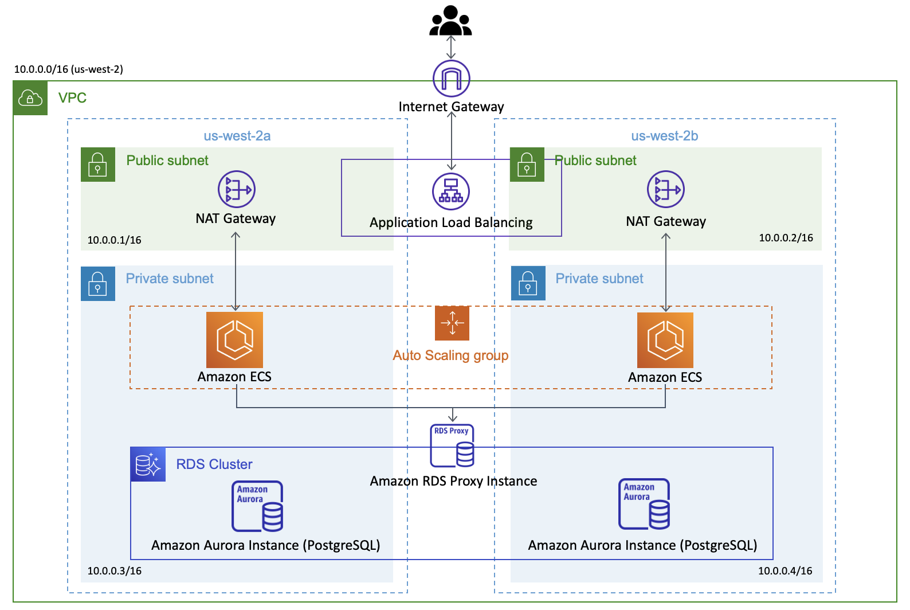

[English README.md](./README.md)

PageNow 홈페이지: https://pagenow.io <br/>
PageNow 크롬 웹스토어: https://chrome.google.com/webstore/detail/pagenow/lplobiaakhgkjcldopgkbcibeilddbmc

# PageNow User API

User API는 PageNow의 사용자 정보, 친구 관계, 그리고 알림과 관련된 정보를 다루는 REST API입니다. User API는 오토 스케일링이 가능하고, 두 개의 availability zone에서 실행되기 때문에 스케일러블 합니다. 또, EC2 인스턴스와 데이터베이스가 VPC 내의 프라이빗 서브넷 속에 위치하여 외부로부터 직접적인 접속이 차단되어 데이터가 안전하게 보관되어 있습니다.

서버는 Fast API로 개발되었고, 데이터베이스에는 PostgreSQL이 사용되었으며, 클라우드 배포에는 Terraform이 사용되었습니다. 파이썬의 비동기(aysnc) 기능과 데이터베이스 인덱싱을 통해 서버의 성능을 최적화시켰습니다.

## 시스템 아키텍쳐

아래는 시스템 아키텍쳐 다이어그램입니다.



## 시스템 구성 요소(Components)

아래는 User API를 구성하는 부분들에 대한 간단한 설명입니다.

### AWS ECS

백엔드는 ECS(Elastic Container Service)로 실행이 됩니다. User API 코드를 도커화 시켜 ECR(Elastic Container Registry)에 업로드하고, ECS의 인스턴스가 그 도커를 실행합니다.

### AWS Application Load Balancer

로드 밸런서는 API에 들어오는 트래픽을 두 개의 ECS 태스크 중 하나로 포워딩합니다.

### AWS Auto Scaling

각 클러스터에 있는 인스턴스 개수는 활용 정도에 따라 AWS Auto Scaling에 의해 자동으로 조정됩니다.

### AWS RDS

RDS 클러스터에는 Amazon Aurora PostgreSQL 인스턴스가 사용되고 있습니다. 이 인스턴스는 `core_db`라는 데이터베이스를 호스트하고, 이는 [presence-api](https://github.com/PageNow/presence-api)와 [chat-api](https://github.com/PageNow/chat-api)도 사용합니다.

* `user_table`은 이메일, 이름, 공유 도메인 배열 등의 사용자 정보를 저장합니다.

* `friendship_table`은 유저 간의 친구 관계를 저장합니다. 사용자 간 친구 관계를 관리하기 위해 한 개의 테이블이 사용되는데 *accepted_at*이라는 열로 *none friendship*, *pending friendship*, *accepted friendship* 상태를 구분합니다.

* `share_notification_table`는 사용자가 친구들에게 보내는 공유 알림을 저장합니다. 각 알림은 공유된 페이지의 주소와 제목으로 구성되어 있습니다.

* `share_notification_seen_table`는 사용자가 수신한 알림을 읽었는지를 안 읽었는지를 저장합니다.

데이터베이스 스키마 그림은 다음과 같습니다.


### AWS RDS Proxy

RDS Proxy는 데이터베이스 연결을 효율적으로 관리해주는데, [presence-api](https://github.com/PageNow/presence-api)와 [chat-api](https://github.com/PageNow/chat-api)도 이 RDS에 연결하기 때문에 RDS Proxy가 사용되었습니다.

### AWS API Gateway

API Gateway는 API 요청을 AWS Load Balancer에게 포워딩 시킵니다.

## 프로젝트 구조

다음은 User API 코드의 구조와 주요 기능이 어느 경로에 있는지에 관한 설명입니다.

### api

API의 엔드포인트 정의는 [app/api/endpoints](./app/api/endpoints/)에서 찾을 수 있습니다. AWS Cognito를 활용한 사용자 인증 기능은 [app/api/auth](./app/api/auth/)에 위치합니다. Cognito JWT를 처리하여 인증하는 코드는 디펜던시(dependency)로 인증이 필요한 엔드포인트에 삽입(inject)됩니다.

### crud

데이터 모델을 다루는 모든 기능은 [app/crud](`./app/crud/`)에서 찾을 수 있습니다.

### db

서버가 실행되면 우선 데이터베이스와 연결을 시도하고, 서버가 종료되면 데이터베이스와 연결을 끊습니다. 이러한 데이터베이스 연결 관리는 [app/db](`./app/db/`)의 코드가 처리합니다.

### models

데이터베이스 테이블은 [app/models](`./app/models`)에 정의되어 있습니다. 새로운 테이블을 추가하면 [alembic/env.py](./alembic/env.py)도 업데이트해야 합니다.

### schemas

SQLAlchemy 스키마는 [app/schemas](`./app/schemas/`)에 정의 되어 있습니다.

## 로컬 설정

### 도커에서 구동되는 PostgreSQL 인스턴스 연결

아래의 명령을 실행합니다.
```shell
$ docker exec -it postgres_local psql -h localhost -U USERNAME --dbname=DBNAME
```

### 데이터베이스 마이그레이션(migration)

새로운 테이블, 테이블 정의 변경과 같은 업데이트가 있을 경우 *alembic*을 사용해 그 변화를 실제 데이터베이스로 마이그레이션해야 합니다.

```shell
$ docker-compose run web alembic revision --autogenerate -m "MESSAGE" # make migrations
$ docker-compose run web alembic upgrade head # migrate
```

alembic 버전을 초기화시키고 싶으면 PostgreSQL에 연결하여 모든 테이블을 제거한 후 위의 명령을 실행합니다.

## 로컬 실행

### 서버를 로컬에서 실행하기

도커를 통하지 않고 서버를 로컬에서 실행하고 싶다면 다음 명령을 실행합니다.
```shell
$ export RDS_HOST=localhost
$ uvicorn app.main:app --host 0.0.0.0 --port 8000 --reload
```

### 도커에서 서버를 실행하기

```shell
$ docker-compose up -d # build and deploy
```

## 클라우드에서 서버 구동

### 도커 이미지를 ECR에 업로드하기

아래에서 *257206538165*를 AWS 계정 아이디로 바꾼 후 명령들을 실행합니다.
```shell
$ aws ecr get-login-password --region us-west-2 | docker login --username AWS --password-stdin 257206538165.dkr.ecr.us-west-2.amazonaws.com
$ docker build -t 257206538165.dkr.ecr.us-west-2.amazonaws.com/pagenow-user-api:latest .
$ docker push 257206538165.dkr.ecr.us-west-2.amazonaws.com/pagenow-user-api:latest
```

### ECS 태스크 업데이트 하기

위의 방법을 통해 도커 이미지를 ECR에 업로드한 후에 다음 명령으로 ECS 태스크를 업데이트 후 재시작 시킵니다.
```shell
$ python update-ecs.py --cluster=user-api-production-cluster --service=user-api-production-service
```

## 클라우드 배포

### Terraform 설정

AWS 로그인 정보를 환경 변수로 설정합니다.
```shell
$ export AWS_ACCESS_KEY_ID="YOUR_AWS_ACCESS_KEY_ID"
$ export AWS_SECRET_ACCESS_KEY="YOUR_AWS_SECRET_ACCESS_KEY"
$ export AWS_DEFAULT_REGION="YOUR_AWS_REGION"
```

RDS 비밀번호를 환경 변수로 설정합니다.
```shell
$ export TF_VAR_rds_password=RDS_PASSWORD
```

다음 명령들로 클라우드 리소스를 업데이트합니다.
```shell
$ terraform plan
$ terraform apply
```

API Gateway는 https://docs.aws.amazon.com/apigateway/latest/developerguide/api-gateway-create-api-as-simple-proxy-for-http.html를 참고하여 설정할 수 있습니다. 이 때 엔드포인트 주소는 'http://${alb_dns}/{proxy}'입니다. 변경 후에 배포(deploy)를 합니다.

### Bastion 인스턴스를 통한 RDS 접속

Bastion EC2 인스턴스로 프라이빗 서브넷 내의 ECS 인스턴스를 접속하고, 이를 통해 결국 RDS에 접속할 수 있습니다.

1. Bastion 인스턴스(bastion-instance)의 퍼블릭 IP와 ECS 인스턴스(private-instance)의 프라이빗 IP를 얻습니다.

2. SSH config 파일을 다음과 같이 업데이트 합니다.
```
Host bastion-instance
   HostName <Bastion Public IP>
   User ubuntu
Host private-instance
   HostName <Private IP>
   User ubuntu
   ProxyCommand ssh -q -W %h:%p bastion-instance
```
3. `ssh -i "~/.ssh/id_rsa" private-instance`로 ECS 인스턴스에 SSH로 접속합니다.

### ECS RDS 데이터베이스 테이블 정의 업데이트

1. SSH로 EC2 인스턴스 접속.

2. `docker ps`로 도커 컨테이너 아이디 획득.

3. `docker exec -it DOCKER_CONTAINER_ID alembic revision --autogenerate -m "MESSAGE"` 실행.

4. `docker exec -it DOCKER_CONTAINER_ID alembic upgrade head` 실행.

### RDS 접속

1. SSH로 EC2 인스턴스 접속.

2. `docker ps`로 도커 컨테이너 아이디 획득.

3. `docker exec -it DOCKER_CONTAINER_ID psql -h RDS_PROXY_ADDRESS -U USERNAME --dbname=DBNAME` 실행.

### 로컬 데이터베이스와 클라우드 데이터베이스 테이블 정의 동기화

1. RDS에 접속하여 `drop table alembic_version`을 실행하여 alembic 버전 테이블 제거.

2. 다음 명령 실행.
```
$ docker exec -it DOCKER_CONTAINER_ID alembic stamp head
$ docker exec -it DOCKER_CONTAINER_ID alembic revision --autogenerate -m "New revision"
$ docker exec -it DOCKER_CONTAINER_ID alembic upgrade head
$ docker exec -it DOCKER_CONTAINER_ID alembic stamp head
```

참조: https://stackoverflow.com/questions/32311366/alembic-util-command-error-cant-find-identifier
